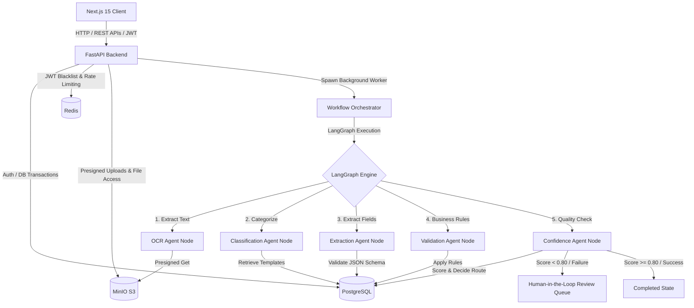

# System Architecture - AI Document Intelligence Platform

This document outlines the architectural design of the production-grade Applied AI Document Intelligence Platform.

## 1. High-Level System Architecture

The platform is designed with a modern, microservices-friendly decoupled architecture. It consists of a React/Next.js frontend, an asynchronous FastAPI backend, a relational database (PostgreSQL), an in-memory database/cache (Redis), and an S3-compatible object storage server (MinIO).

---

## 2. Core Components

### A. Next.js 15 Frontend
- **Dual API / Demo Mode**: Seamlessly works with the active FastAPI server or defaults to a high-fidelity local simulation using `LocalStorage` when offline.
- **Dynamic Dashboard**: Displays processing latency, token cost breakdowns, and document queue volumes.
- **Reviewer Side-by-Side Editor**: Allows reviewers to view the document image/PDF side-by-side with the extracted JSON structure, highlighting fields that failed validation or had low confidence scores.

### B. FastAPI Backend
- **Asynchronous Stack**: Implemented completely using Python's `asyncio` and `async/await` syntax for high concurrency.
- **Dependency Injection**: Utilizes FastAPI dependencies for authentication, database session management, and settings config.
- **Structured Error Handling**: Centralized exception handler middleware returning RFC-compliant JSON responses.

### C. LangGraph Workflow Orchestrator
- **State Machine Routing**: Organizes document intelligence into a sequence of isolated, modular agent nodes.
- **State Persistence**: The orchestrator saves the intermediate state of the workflow at the completion of each node into the PostgreSQL database.
- **Graceful Error Handling & Fallbacks**: If a node fails (e.g. LLM timeout), the orchestrator registers the error message and gracefully updates the document status to `failed`.

### D. PostgreSQL & SQLite Compatibility
- **Database Engine**: Uses SQLAlchemy 2.0 with the `asyncpg` driver for production.
- **Testing Engine**: Uses an in-memory SQLite database (`aiosqlite`) for fast, isolated, and parallelized unit test execution.

### E. Redis Cache
- **JWT Blacklist**: Used to verify revoked session refresh tokens instantly.
- **Fallback Mode**: In the absence of a Redis instance, the backend gracefully falls back to an in-memory blacklisting store.

### F. MinIO Object Storage (S3-compatible)
- **Direct S3 Integration**: Integrates via the `boto3` client.
- **Presigned URLs**: Ensures secure, time-limited read/write access to files directly from the Next.js client, preventing backend server bottlenecking during massive uploads.

---

## 3. Data Processing Lifecycle

1. **Upload Phase**:
   - The Next.js client requests a presigned upload URL from `/api/v1/documents/upload`.
   - The backend validates the request, creates a new `Document` record with status `uploaded`, and returns the presigned URL.
   - The client uploads the file directly to the S3 bucket.

2. **Ingestion & Processing Phase**:
   - Once upload completes, the client hits the backend to trigger the processing workflow.
   - The backend spawns a non-blocking asynchronous task running the LangGraph workflow orchestrator.
   - A `WorkflowRun` is created in the database to track execution progress.

3. **Agent Workflow Execution**:
   - **OCR Node**: Extracts raw text from the document image or PDF.
   - **Classification Node**: Inspects the text and maps it to a database-defined document type template (e.g., Invoice, Receipt).
   - **Extraction Node**: Leverages LLM Structured Outputs to convert text into JSON schema-compliant data fields.
   - **Validation Node**: Compares extracted values against custom programmatic constraints (e.g., date formats, total sum matching line items).
   - **Confidence Node**: Generates an overall confidence metric and evaluates if manual inspection is required.

4. **Human Review (Optional HITL)**:
   - If the confidence score is below `0.80`, or if critical schema fields are missing or invalid, the workflow transitions to `review_needed`.
   - Reviewers inspect the document using the frontend dashboard, correct any errors, and submit corrections.
   - Submitting a review transitions the document to `completed` and records a detailed audit log in the `reviews` table.

5. **Completion Phase**:
   - The final JSON data is locked into the `extracted_data` table.
   - Detailed logs including total latency, token usage, and execution details are stored for system analytics.
