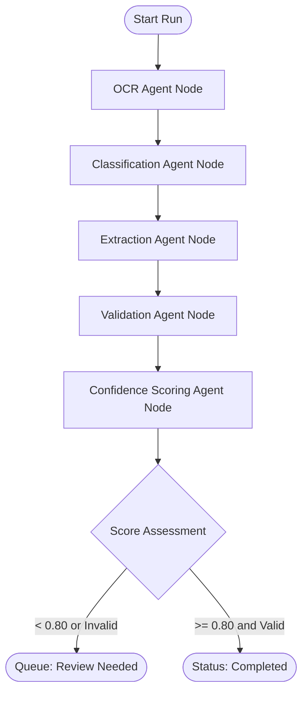

# Workflow Design & Agent States - AI Document Intelligence Platform

This document describes the design of the LangGraph-based Document Ingestion & Extraction workflow.

---

## 1. LangGraph Workflow DAG

The processing flow is governed by a directed acyclic graph (DAG) implemented via LangGraph. Each node is an isolated Python function or Class method running an agent action, sharing a mutable state.



---

## 2. Graph State Schema

The shared graph state holds intermediate processing structures. The schema is implemented using Pydantic:

```python
class DocumentState(TypedDict):
    # Core reference variables
    document_id: str
    organization_id: str
    storage_path: str
    
    # Processed states
    raw_text: Optional[str]
    document_type_name: Optional[str]
    doc_type_id: Optional[str]
    
    # Data extraction payloads
    schema_definition: Optional[Dict[str, Any]]
    extracted_data: Optional[Dict[str, Any]]
    confidence_scores: Optional[Dict[str, Any]]
    
    # Validation errors
    validation_errors: List[Dict[str, Any]]
    
    # Overall score
    overall_confidence: float
    
    # Execution tracing metrics
    steps_completed: List[str]
    token_usage: Dict[str, Any]
    error_message: Optional[str]
```

---

## 3. Node Specifications & Internal Logic

### A. OCR Agent Node (`ocr_agent`)
- **Responsibility**: Ingest raw binary files (PDF, TIFF, JPEG) and produce text structures.
- **Implementation**:
  1. Retrieves the file from the MinIO/S3 bucket using the stored `storage_path`.
  2. Executes Tesseract or PaddleOCR locally on the file pages.
  3. **Multimodal LLM Fallback**: If the local OCR libraries fail to load (common in local Apple Silicon setups or production containers lacking complex binary packages), it feeds the image bytes directly to a multimodal LLM (e.g. `gpt-4o-mini` or `claude-3-5-sonnet`) with instructions to output all text contents exactly.
  4. Appends `raw_text` to the state.

### B. Classification Agent Node (`classification_agent`)
- **Responsibility**: Determine the document category (e.g. Invoice, Receipt, Contract).
- **Implementation**:
  1. Fetches all registered document type names and schemas for the organization from the DB.
  2. Constructs a prompt listing categories, descriptions, and the raw text output.
  3. Prompts the LLM to classify the document and returns the matches.
  4. Appends `document_type_name` and `doc_type_id` to the state.

### C. Extraction Agent Node (`extraction_agent`)
- **Responsibility**: Convert unstructured OCR text into structured JSON matching the target schema.
- **Implementation**:
  1. Extracts the dynamic JSON schema definition for the matched document type.
  2. Utilizes **Structured Output Enforcements** (via Pydantic parser or OpenAI structured format constraints) to enforce correct data types and structures.
  3. Appends `extracted_data` to the state.

### D. Validation Agent Node (`validation_agent`)
- **Responsibility**: Evaluate logical correctness of the fields extracted.
- **Implementation**:
  1. Validates that all fields declared `required` in the schema are present and non-empty.
  2. Executes programmatic check validations (e.g., verifying that the total invoice sum matches the sum of line items: `item_prices.sum() == total_amount`).
  3. Checks that date fields conform to ISO 8601 formatting.
  4. Appends a list of structured warnings or block failures to `validation_errors` in the state.

### E. Confidence Agent Node (`confidence_agent`)
- **Responsibility**: Aggregate checks, assess prediction likelihood, and route the workflow.
- **Implementation**:
  1. Computes an overall confidence score based on:
     - The token probability scores returned by the LLM extraction tool.
     - The quantity and severity of validation errors.
     - Self-reflection scoring (asking the LLM to rate its own confidence from 0.0 to 1.0 based on structural coherence).
  2. Sets `overall_confidence` in the state.
  3. **Router Routing**:
     - If `overall_confidence` is `< 0.80` or if any blocking validation error is present, routes to `review_needed`.
     - Otherwise, routes to `completed`.
